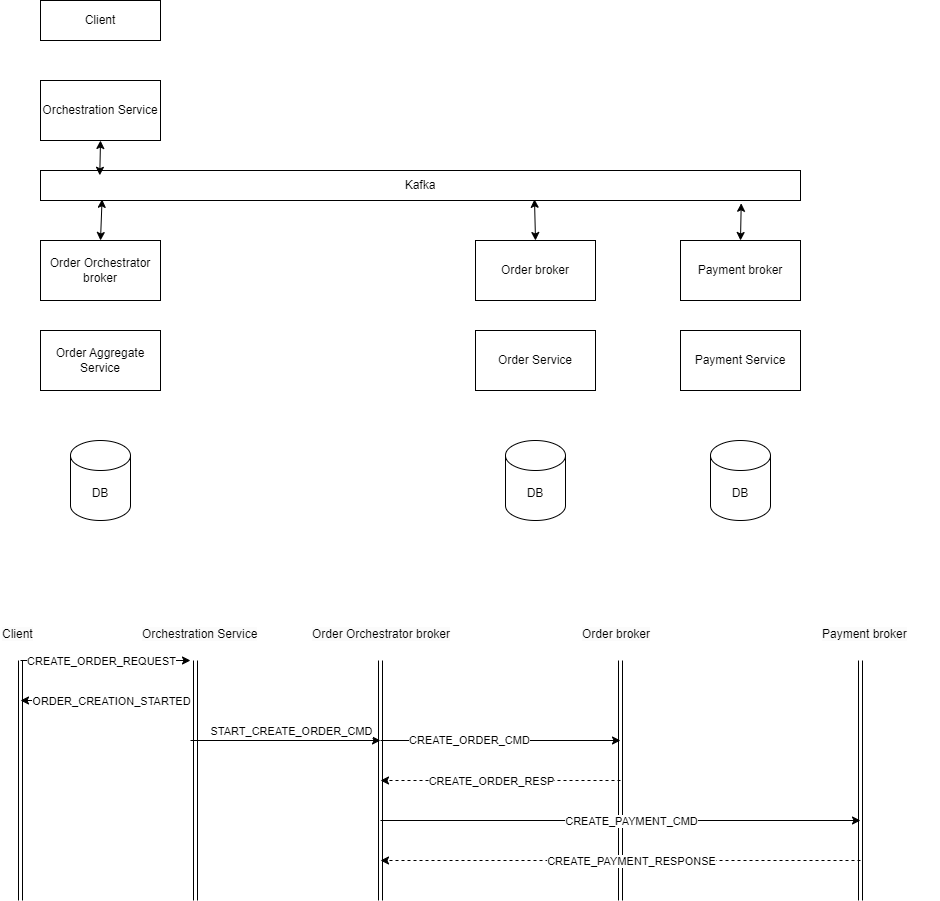

# Saga with orchestration. Design attempt

## TODOs

1. Refactoring aggregate service with final state machine
2. Add better logging
3. Use db as a storage
4. Graceful shutdown for console apps(not by a button click)
